<div align="center">

# Yukti

**Sovereign Industrial AI Workbench. Governed, cited, audited answers for the refinery floor, fully on-premise.**

[](CHANGELOG.md)
[](docs/DEPLOYMENT.md)
[](docs/SECURITY_MODEL.md)
[](#team)
[](https://github.com/Juhilhere/Yukti/actions/workflows/ci.yml)

### [⬇ Download Yukti for Windows](https://github.com/Juhilhere/Yukti/releases/latest/download/Yukti-Setup.exe)
One file. Double-click it — Yukti installs, downloads its AI once and opens. English · हिंदी · ಕನ್ನಡ

Smart India Hackathon 2026 · Problem statement **SIH26117** (Mangalore Refinery and Petrochemicals Ltd) · **Team UniMinds**

</div>

> Team UniMinds is **not affiliated with MRPL**. MRPL facts in Yukti are public information with source links.
> The plant documents shipped with Yukti are **EXAMPLES written by Team UniMinds**, watermarked on every page and badged in the UI.

---

## Why

**02:15 AM. Pump A2 on the crude unit trips.** The standby pump takes over, the MCC overload flag is on, and the on-call
electrician is asked to isolate the motor "per SOP-EL-014".

The answers they need are spread across a datasheet, two revisions of the SOP, two revisions of the P&ID and the single-line
diagram, a troubleshooting guide, a work-order export and the shift log. One revision is superseded. Two drawings disagree.
Some records belong to departments they are not cleared for. A general-purpose chatbot would blend all of this into one
confident paragraph, and it would need the data to leave the plant to do it.

Yukti does it differently:

- It checks **who is asking** before it reads anything.
- It retrieves **only the documents that person may see**, and says how many were withheld and why.
- It lays out the facts as **KNOWN, MISSING or CONFLICTING** and recommends the current revision.
- It answers on a **local model**, cites every sentence, and **records the whole exchange** in a tamper-evident audit log.

<p align="center">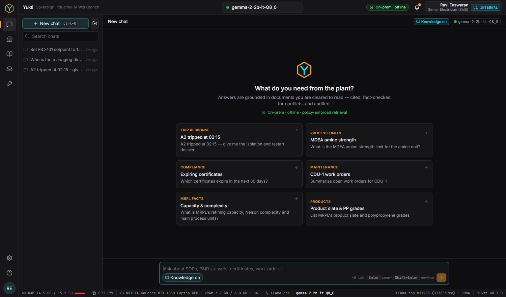</p>

## What it does

| | Capability | Details |
|---|---|---|
| 🔐 | **Identity and policy first** | argon2id passwords, server sessions, CSRF, lockout, TOTP MFA. A deterministic ABAC policy (YAML, deny-overrides, default deny) runs before every read, search and citation. |
| 🧭 | **Laya intent router** | ONNX classifier (~1 ms) that sets intent, department, urgency and sensitivity before any LLM call. |
| 🛡️ | **Company guardrails** | Policy rules refuse off-domain harm and control-system changes. They also restrict process-chemistry detail by role and clearance. |
| 📚 | **Policy-filtered retrieval** | SQLite FTS5 (BM25) over OCR'd and digital documents. Superseded revisions are down-weighted. Withheld documents are counted, never shown. |
| ⚖️ | **Evidence, not vibes** | Facts are marked KNOWN / MISSING / CONFLICTING, with candidates, revisions and a recommended value. |
| 🧠 | **Local LLM with citations** | Bundled llama.cpp (CUDA or Vulkan, chosen automatically). A watchdog restarts a crashed or hung engine. Every answer cites `[S#]` / `[F#]`. |
| 📷 | **Ask with a photo** | Photograph a pipe stencil, tag plate, nameplate or gauge. The text on it is read offline (OCR) and matched to the asset register, and Gemma 3 looks at the picture. The line or chemical is named only from a readable tag and the plant's documents, never guessed from colour. Rust, leaks and damage are pointed out. Photos are stripped of location data and visible only to the sender. *Optional add-on, added from the home screen.* |
| 🎙️ | **Speak instead of typing** | Offline Whisper speech recognition (large-v3-turbo on an NVIDIA GPU, small on the processor), hinted with the plant's own tags. The words land in the question box for checking; nothing is sent until you press Send. English, Hindi and Kannada. *Optional add-on, added from the home screen.* |
| 🧾 | **Hash-chained audit** | Append-only SHA-256 chain with one-click verification and CSV/JSONL export. |
| 📥 | **Governed knowledge** | Only Heads of Department add or remove documents, and only for their own department. Uploads are OCR'd, tagged, chunked and indexed. |
| ✅ | **Access and findings workflows** | Time-bound access grants approved by the HOD. Inspection findings with per-role allowed actions and escalation. |
| 🏭 | **Asset ledger and production** | Certificate and calibration expiry alerts. A HiGHS LP optimizer runs only on a plant model the planner enters. |
| 🌐 | **MRPL public intelligence** | 140 public sources, 43 departments, 56 process units and 31 products, each with source links. Conflicting public figures are flagged. |
| 🛠️ | **Administration** | Users (including CSV import), organisation-wide AI settings (67 load + 35 sampling parameters), models, measured usage, backups and restore. UI in English, Hindi and Kannada. |

## Screenshots

| | |
|---|---|
| 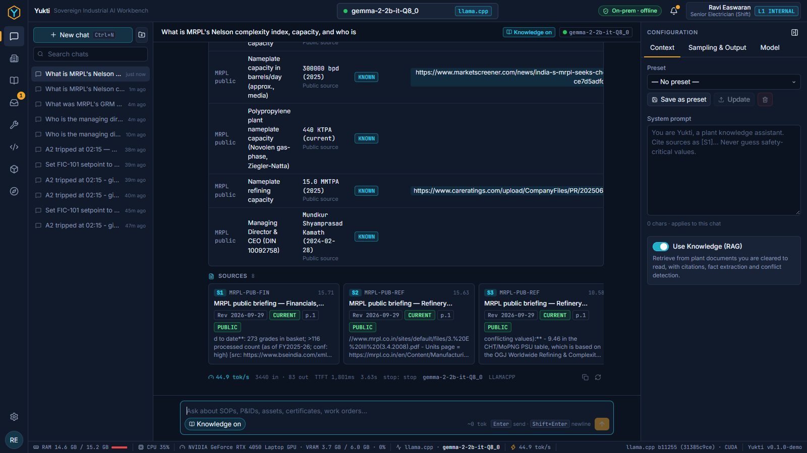<br>**Conflicting sources surfaced with a recommendation** | 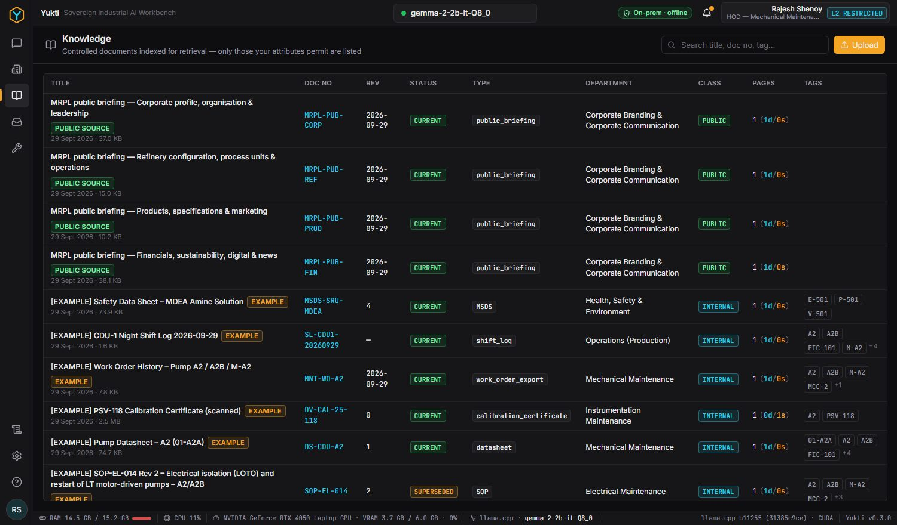<br>**Knowledge: HOD uploads for own department** |
| 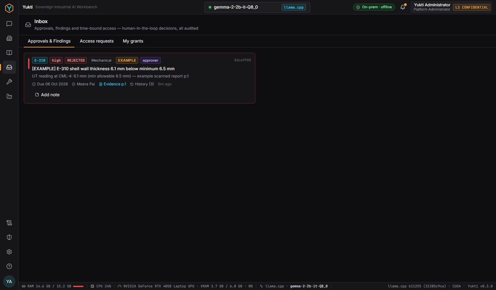<br>**Inbox: access requests and findings** | 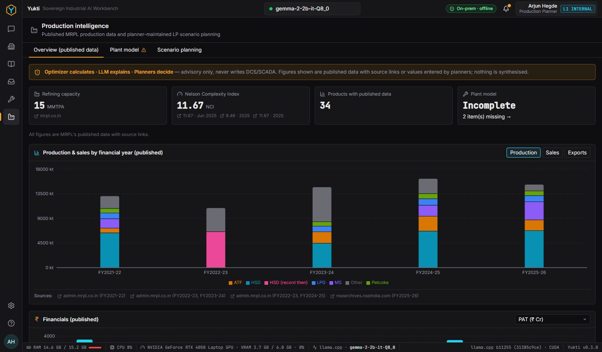<br>**Production intelligence (public data + planner LP)** |
| 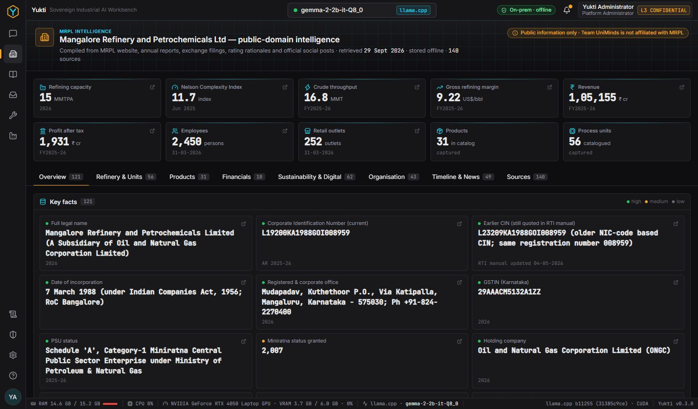<br>**MRPL public intelligence with sources** | 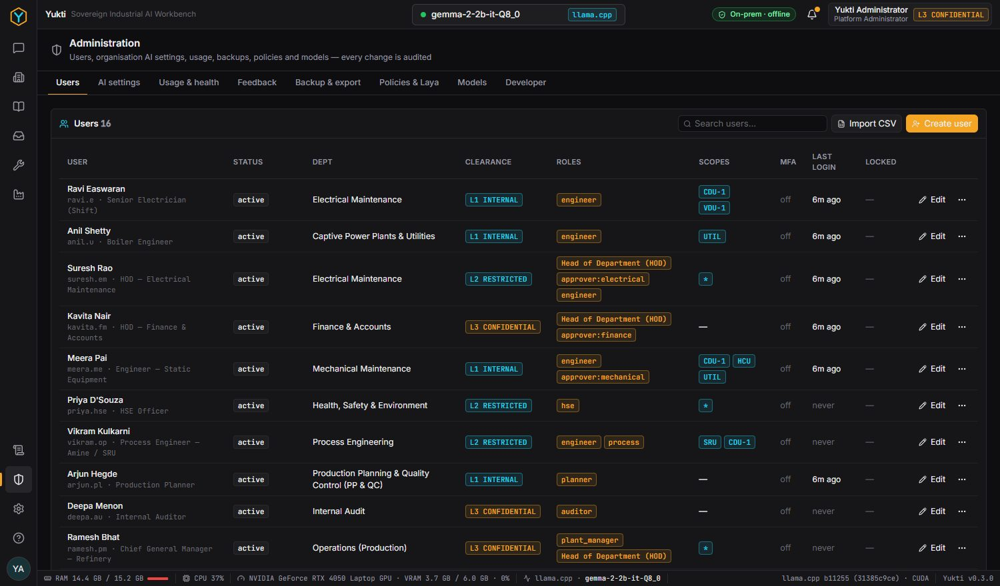<br>**Admin: users, roles, MFA, CSV import** |
| 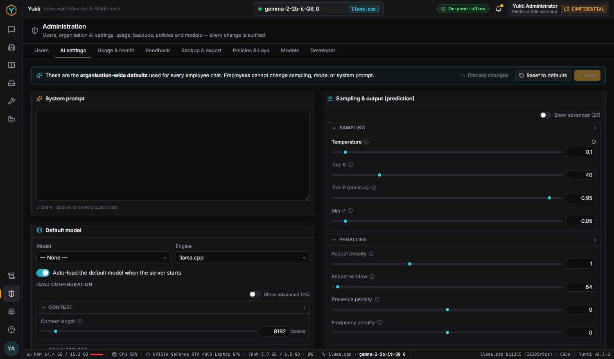<br>**Admin: organisation-wide AI settings** | 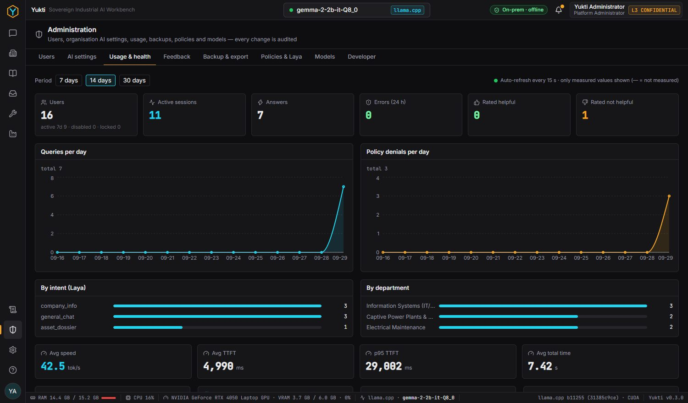<br>**Admin: usage and health (measured values only)** |
| 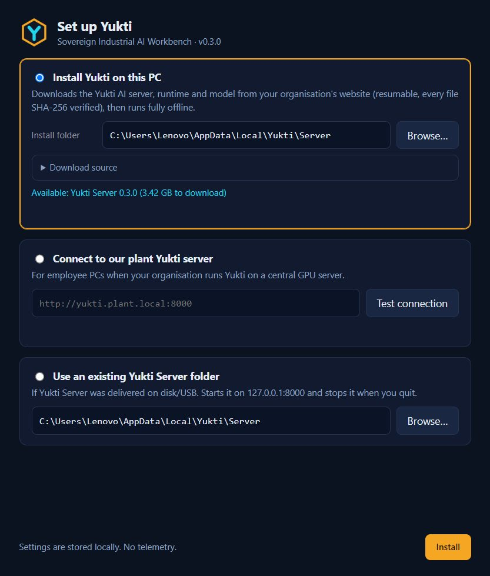<br>**Desktop app: install, connect or use existing** | |

## Architecture

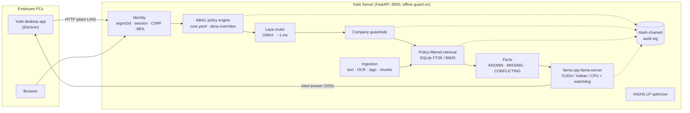

The full design is in [docs/ARCHITECTURE.md](docs/ARCHITECTURE.md).

## Get started

### For users: one download, one double-click

1. Download **[Yukti-Setup.exe](https://github.com/Juhilhere/Yukti/releases/latest/download/Yukti-Setup.exe)** — the only file you need.
2. Double-click it. It installs in a few seconds (no questions, no admin rights) and opens Yukti. If Windows shows
   *“Windows protected your PC”*, choose **More info → Run anyway**.
3. Yukti sets itself up: it downloads what it needs to answer questions, once (2.7 GB, or 3.4 GB on a PC with an
   NVIDIA graphics card: the server, the AI engine for your computer and the AI model). It checks every piece and
   continues by itself if the internet drops. Then it starts and shows the sign-in page.
4. Sign in. From now on Yukti works **without internet**. Choose English, हिंदी or ಕನ್ನಡ at any time.
5. Optional, whenever you like: on the home screen, the administrator clicks **Add** under **📷 Ask with photos**
   (about 800 MB) or **🎙️ Speak instead of typing** (0.3 GB, or 1 GB with an NVIDIA card). They are also under
   *Admin → New abilities*, where they can be removed again. Keeping them separate keeps the first download small.

Something not working? **Help → Report a problem** in Yukti fills in the technical details for you.
Uninstall from *Windows Settings → Apps*; it asks before deleting your documents and chats.

For PCs without internet, the offline package (`ops\release-site.ps1` → one zip with everything) can be copied by USB.

See the [User Guide](docs/USER_GUIDE.md).

### For administrators: run the server

The **Yukti Server** package is self-contained. It includes `yukti-server.exe`, llama.cpp CUDA 12.4 and Vulkan builds,
the default model Gemma-3-4B-it Q4_K_M with its image module, Whisper speech recognition (whisper.cpp), a pre-trained Laya, the UI and the data. You do **not** need to install Python,
Bionic/LM Studio, Ollama or vLLM. If they are present, Yukti can use them too: models already downloaded in **Ollama**, an **LM Studio**
server, **vLLM**, or any **OpenAI-compatible server by URL** (Model loader → engine → Connection → *Test & save*).

| Goal | Run (inside the package folder) |
|---|---|
| This PC only | open `Yukti.exe` (or `server\Start Yukti Server.cmd` for the server alone) |
| Serve desktop clients on the plant LAN | `server\Start Yukti Server (Plant LAN).cmd` (0.0.0.0:8000; allow TCP 8000 **for the plant subnet only**) |
| Publish the download on a website | `ops\build-release.ps1`, then `ops\release-site.ps1`, then upload `E:\yukti-build\publish\` (download page + the one zip) |

See [Deployment](docs/DEPLOYMENT.md) and the [Admin Guide](docs/ADMIN_GUIDE.md).

### For developers

Requirements: Windows 10/11, [uv](https://docs.astral.sh/uv/) with Python 3.12, Node 22. For GPU inference you also need a
llama.cpp `llama-server` build (see `backend/app/config.py`).

```powershell
# backend
cd backend
$env:UV_PYTHON_PREFERENCE = "only-managed"
uv sync

# web UI (served by the backend from web\dist)
cd ..\web
npm ci
npm run build            # or: npm run dev  (Vite on :5173, proxies /api to :8000)

# run
cd ..
.\ops\start.ps1          # API + UI on http://127.0.0.1:8000, auto-loads the default model
.\ops\start-server.ps1 -Lan   # same, listening on 0.0.0.0:8000 for desktop clients
.\ops\stop.ps1

# desktop client
cd desktop
npm ci
npm start                # dev
npm run dist             # -> desktop\dist\Yukti-Setup-0.3.0.exe
```

On first start the server seeds the database with demo employees, MRPL public data and the example documents (including OCR).
This takes about 30 s. To reset, stop the server, delete `data\store\` and start again.

## Roles

| Role | What they can do |
|---|---|
| **Employee** (engineer, HSE, process, contractor…) | Chat over the knowledge they may see, view sources and facts, request access, work their inbox, give feedback, manage their own password and MFA |
| **Head of Department** (`dept_manager`) | Everything above, plus **add and remove documents for their own department only**, approve access requests, act on findings, view the audit log |
| **Plant manager** | Approve access and findings, view the audit log and production |
| **Planner** | Production intelligence, and enter or edit the plant model used by the optimizer |
| **Auditor** | Audit log, chain verification and export |
| **Administrator** | **All LLM configuration** (models, engines, 67 load + 35 sampling parameters, AI settings, presets), users, usage and health, backups and restore, policies, Laya benchmark, developer logs |

Employees never see or change LLM settings. Every chat uses the organisation settings the administrator chose.
Administrators do not upload documents; that belongs to the HOD of each department.

## Repository layout

```
backend/
  app/            FastAPI app: auth, admin, policy, audit, engine, llm_params, rag, laya, chat,
                  mrpl, mrpl_facts, production, reports, seed, config, db
  policies/       core.yaml (ABAC + company guardrails)
  server_main.py  entry point of yukti-server.exe (PyInstaller)
  tests/          pytest suite (no GPU needed)  ·  tests/live/ end-to-end and stress tests
web/              React + Vite + Tailwind SPA
desktop/          Electron client and in-app component installer
data/
  mrpl/           MRPL public research (JSON + Markdown, every fact with its source)
  corpus/         EXAMPLE plant documents (watermarked) + gen_corpus.py generator
  structured/     example asset ledger / work orders described by the example documents
ops/              start/stop scripts, release build, website publisher, package templates
docs/             architecture, security model, deployment, guides, API, screenshots
```

## Performance (measured)

Measured on an RTX 4050 laptop GPU (6 GB) with Gemma-2-2B-it Q8_0:

| Backend | Generation | Time to first token |
|---|---|---|
| llama.cpp CUDA 12.4 | **51.7 tok/s** | 0.2 s |
| llama.cpp Vulkan | 50.8 tok/s | not recorded |
| CPU only | 13.4 tok/s | not recorded |

Version 0.5.0 ships Gemma-3-4B-it Q4_K_M with its image module instead, measured on the same GPU:

| What | Measured |
|---|---|
| Gemma 3 4B generation (llama.cpp CUDA) | 44–58 tok/s |
| Answer to a photo question (OCR + model) | 4–10 s |
| Speech to text, Whisper large-v3-turbo on the GPU | 0.3–0.4 s for a 4 s question (first use ~3 s while it loads) |
| Speech to text, Whisper small on the processor | ~3.5 s per question |
| Gemma 3 + Whisper turbo together | 5.1 of 6 GB video memory |

Laya routes in about 1 ms. The usage dashboard reports only values measured on your own server.

## Testing

| Suite | Command | Needs |
|---|---|---|
| Unit / API tests | `cd backend; uv run pytest` | nothing (no GPU, no model) |
| Live end-to-end (74 checks) | `cd backend; uv run python tests/live/e2e_live.py` | a running server with a model loaded |
| Stress / fault injection | `cd backend; uv run python tests/live/stress_live.py` | a running server (it kills and reloads the engine) |
| Web type-check + build | `cd web; npm run build` | Node 22 |
| Desktop installer self-test | `cd desktop; npm test` | Node 22 |

CI ([`.github/workflows/ci.yml`](.github/workflows/ci.yml)) runs on every push to `main` and on every PR. It runs:

- the backend pytest suite on `windows-latest`
- the web type-check and build, plus a check that the bundle references no external URLs
- desktop syntax checks and the installer self-test

## Security

- The **LLM never makes access decisions.** Policy runs in host code, before retrieval, on attributes taken from the database.
- **Deny-overrides and default deny.** Rules fail closed on errors.
- **Offline guard.** The server blocks outbound network connections except to loopback and engines the admin configured.
- **Tamper-evident audit.** Every login, denial, retrieval, answer and admin action is hash-chained.
- Documents are treated as **data, not instructions**. Unknown citations are flagged.

Read the full [Security Model](docs/SECURITY_MODEL.md). To report a vulnerability, see [SECURITY.md](SECURITY.md).

To report a bug or any other problem, email **juhilprogramming@gmail.com** (inside the app: Help → Report a problem).

## Real vs example data

| Real (measured or sourced) | Example (written by Team UniMinds, badged) | Not included (must come from the plant) |
|---|---|---|
| All software behaviour, every setting, tok/s, TTFT, audit hashes, policy decisions. MRPL public data from 140 sources with links. | 15 plant documents (A2 pump datasheet, SOP-EL-014 r2/r3, P&ID and SLD revisions, troubleshooting guide, E-310 and PSV-118 scans, finance audit, amine MSDS and manual, shift log, A2 work orders) and the assets and work orders they describe | Plant yields, prices and contracts for the optimizer (the planner enters them); the real asset register; real documents; the HR directory (CSV import) |

## Roadmap

These items are **not done yet**:

- **Code-signed installers.** `Yukti-Setup` and `yukti-server.exe` are currently unsigned, so SmartScreen warns on first run.
- **Built-in TLS.** The server speaks HTTP. For now, run it on a segregated plant network or behind a TLS-terminating proxy.
- **Domain guard model.** Guardrails currently use rule-based categories on the base model. A fine-tuned domain guard model is planned.
- **Connectors** to real document management, CMMS and SAP systems. Today documents enter only through HOD upload.
- **Server on Linux.** Only a Windows package is built today.
- **Evaluation on real plant documents** once they are available under an agreement with the plant.

## Team

**Team UniMinds**: Juhil Modi (lead), Saswata Das, Harshit Tiwari, Rohan Jangam, Ritesh Prajapati, Sanskriti.

Built for Smart India Hackathon 2026, problem statement SIH26117.

## Notice

Copyright © 2026 Team UniMinds. All rights reserved. This is proprietary software prepared for Smart India Hackathon 2026 (SIH26117).
Proprietary, under the [Yukti Proprietary Licence](LICENSE): the IP stays with Team UniMinds (per SIH rules), MRPL and the Ministry of Petroleum and Natural Gas get free lifetime use, the SIH organisers may evaluate it, and anyone else needs our written permission. See also [NOTICE](NOTICE). Third-party components and their licences are listed in [THIRD_PARTY_NOTICES.md](THIRD_PARTY_NOTICES.md).
