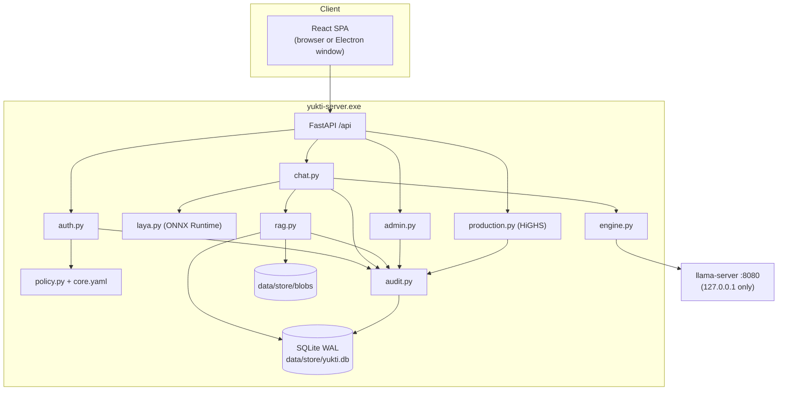
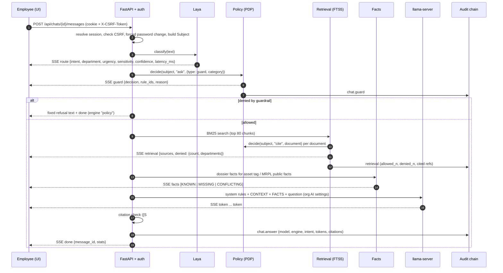

# Yukti architecture

This document describes how Yukti 0.3.0 is built and how a request moves through it. For the security view, see
[SECURITY_MODEL.md](SECURITY_MODEL.md). For the HTTP contract, see [API.md](API.md) and [API_v2.md](API_v2.md).

## 1. Components

| Component | Where | Responsibility |
|---|---|---|
| **Yukti Server** | `backend/app/main.py`, `server_main.py` | FastAPI application on `:8000`. Serves the REST/SSE API under `/api` and the SPA from `web/dist`. Frozen into `yukti-server.exe` with PyInstaller. |
| Identity | `auth.py` | argon2id passwords, opaque server-side sessions (cookie `yukti_sid`), CSRF, lockout, forced password change, TOTP MFA and recovery codes. Also role-to-permission mapping and the subject snapshot. |
| Policy decision point | `policy.py`, `policies/core.yaml` | Deterministic ABAC evaluation of YAML rules (simpleeval). Deny-overrides, default deny, fail closed. |
| Laya | `laya.py` | Intent/department/urgency/sensitivity router (TF-IDF + logistic regression exported to ONNX). Also hosts the company-guardrail input classifier. |
| Chat orchestrator | `chat.py` | Laya, then guardrails, then retrieval, then facts, then LLM stream, then citation check, then audit. |
| Knowledge / RAG | `rag.py` | Ingestion (type sniffing, digital/scanned page detection, RapidOCR, tagging, chunking, FTS5) and policy-filtered retrieval. Also dossier facts. |
| Engine manager | `engine.py`, `llm_params.py` | Starts and monitors `llama-server`, maps 67 load + 35 sampling parameters to llama.cpp flags and request fields, streams tokens and runs the watchdog. Also talks to external OpenAI-compatible engines (Bionic/LM Studio, vLLM, remote). |
| Administration | `admin.py` | Users and CSV import, organisation AI settings, usage and health, feedback, backups and restore, model import, Laya benchmark. |
| Production | `production.py` | Public production/financial overview, planner-entered plant model, HiGHS LP scenario solver. |
| MRPL intelligence | `mrpl.py`, `mrpl_facts.py`, `data/mrpl/` | Public research (JSON + Markdown with source URLs). Seeds departments, is ingested as PUBLIC citable documents and backs structured fact search. |
| Reports | `reports.py` | Asset dossier PDF (reportlab) built from the same fact records as chat. |
| Audit | `audit.py` | Append-only, SHA-256 hash-chained log with verification. |
| Seed | `seed.py` | Demo personas, example documents (watermarked, `is_example`), example assets, work orders and findings. |
| Web UI | `web/` | React 18 + Vite + Tailwind SPA. Routes: chat, company, knowledge, inbox, assets, production, audit, admin/*, account, settings, help. UI in English, Hindi and Kannada. |
| Desktop app | `desktop/` | Electron client with three modes (plant server, install on this PC, existing server folder) and an in-app component installer. |
| Release tooling | `ops/` | `build-release.ps1`, `release-site.ps1`, `publish.py`, `serve_site.py`, start/stop scripts, package templates. |



## 2. Request lifecycle: a chat question



Notes:

- Employees cannot supply `prediction` or `system_prompt`. The backend applies the organisation AI settings chosen by an administrator.
- Retrieved text is wrapped in `<doc id=… ref=…>` blocks. The system prompt states that CONTEXT is data and not instructions.
- When relevant documents are withheld, the model is told how many there are and which departments hold them, and to suggest an access request rather than guess.
- Answer statistics (tokens, tok/s, TTFT, total time, denials) go to `answer_stats` and feed the usage dashboard.

## 3. Data model

SQLite in WAL mode (`busy_timeout=5000`, foreign keys on), at `data/store/yukti.db`. Tables:

| Area | Tables |
|---|---|
| Identity | `users`, `sessions`, `login_attempts`, `departments` |
| Knowledge | `documents`, `pages`, `chunks`, `chunks_fts` (FTS5, porter + unicode61), `jobs` |
| Plant (example) | `assets`, `tag_alias`, `ledger_items`, `work_orders`, `contacts`, `facts` |
| Conversations | `projects`, `chats`, `messages`, `presets`, `feedback` |
| Workflows | `access_requests`, `grants`, `findings`, `notifications`, `reports` |
| Configuration | `settings` (org AI settings, production model, …), `engines` |
| Telemetry (local) | `answer_stats`, `laya_log` |
| Audit | `audit_log`. Triggers block `UPDATE` and `DELETE`. |

Original files are stored in `data/store/blobs/` and are fingerprinted with SHA-256.

## 4. Engine management and watchdog

- **Binaries.** The package bundles llama.cpp b11255 builds in `llama\cuda\` (CUDA 12.4) and `llama\vulkan\`. `config.pick_backend("auto")`
  picks CUDA when an NVIDIA GPU is detected (NVML) and the CUDA build exists. Otherwise it picks Vulkan, which also runs on CPU with 0 GPU layers.
  `YUKTI_LLAMA_CUDA` / `YUKTI_LLAMA_VULKAN` override the paths.
- **Launch.** `llama-server` listens on `127.0.0.1:8080` with `--offline`, `--no-webui` and `--metrics`. The load configuration (context, GPU layers, KV
  cache types, flash attention, batching, RoPE, speculative decoding, …) is translated from the 67 load parameters in `llm_params.py`.
  `filter_args` runs `llama-server --help` once and drops any flag the build does not support, so newer or older builds do not fail on renamed flags.
- **Default model.** At startup the server loads the organisation default model. If none is set, it loads the first Gemma GGUF it finds
  (context 16384, all layers on GPU, flash attention, q8_0 KV cache, 2 parallel slots). Set `YUKTI_AUTOLOAD=0` to skip.
- **Watchdog.**
  - If a `llama-server` that had reached *ready* exits unexpectedly, it is restarted with the same settings, at most **3 times per 10 minutes**.
    After that the engine goes to `error` and asks the admin to reduce context or GPU layers.
  - A health monitor polls `/health` every 15 s. If there is no response for about 60 s, it kills the hung process so the watchdog restarts it.
  - Failures during load (usually out of memory) are reported and never retried in a loop.
- **Chats during load or restart.** A request waits up to 120 s while the engine is `loading` or `restarting`. If the engine is switched or restarted
  before any token was produced, the request is retried once on the new engine. If output had already started, the user is asked to press Regenerate.
- **Other engines.** `bionic` (LM Studio-compatible, default `http://127.0.0.1:1234/v1`), `vllm` (`YUKTI_VLLM_URL`) and `remote` (any
  OpenAI-compatible URL) are probed and used through the same streaming path. Only administrators can configure them.

## 5. Ingestion pipeline

Only users with `documents.upload` (Heads of Department) can upload, only into their own department, and never above their own clearance.
The upload limit is 50 MB. Each upload creates a job whose stages are visible in the UI:

| # | Stage | What happens |
|---|---|---|
| 1 | Store & fingerprint | Save to blob store, compute SHA-256. If the new document has the same document number as an earlier one, the older revision is marked `SUPERSEDED`. |
| 2 | Detect type & page modes | PDF pages classified as digital or scanned (pypdfium2). Images are treated as scanned pages. DOCX and XLSX are read structurally. |
| 3 | Extract text / OCR | Text layer, or RapidOCR (PP-OCR on ONNX Runtime) for scanned pages, with a confidence value. XLSX rows become citable records. |
| 4 | Tag assets | Asset tags and aliases (e.g. `A2`, `E-310`, `PSV-118`) are detected and mapped to plant units. |
| 5 | Chunk | About 900 characters with 150 overlap, per page. |
| 6 | Index | Written to `chunks_fts` (FTS5 BM25). |

PDF parsing and OCR are serialised with a lock because pdfium is not thread-safe.

## 6. Retrieval and evidence

1. Asset tags are detected in the question and added to the FTS5 query.
2. The top 80 chunks by BM25 are fetched.
3. **Each document is checked with the policy engine** (`cite` action). Documents the user may not cite are dropped and counted as `denied`
   by department. Their text never reaches the model or the UI.
4. Scoring: tag matches × 1.5, superseded revisions × 0.8. At most 2 chunks per document.
5. **Facts.** When the question concerns an asset (dossier, trip, rating, wiring, isolation, history), structured `facts` rows are evaluated for
   that tag. Each attribute is **KNOWN** (one value), **MISSING** (no authorised source), or **CONFLICTING** (several candidates with source,
   revision and effective date; the current revision is marked *recommended*).
   Company questions are matched against MRPL public facts. When public sources report different numbers, the fact is marked CONFLICTING
   (for example the Nelson Complexity Index, 9.46 vs 11.67).
6. After generation, every `[S#]` / `[F#]` citation is checked against what was actually supplied. Unknown citations are recorded in the message stats.

## 7. Laya

- **Model:** character + word TF-IDF with logistic-regression heads, trained at first start from seeded templates and exported to ONNX
  (`data/store/laya/laya-0.3.0.onnx`). The server package ships a pre-trained copy. Inference runs on ONNX Runtime (CPU) in about 1 ms.
- **Output:** intent, department, urgency (raised for trip, fire, leak, H2S, emergency), sensitivity, route, confidence and an **abstain** flag
  (confidence < 0.40 or margin < 0.10). When Laya abstains, the request falls back to the LLM + RAG route and is marked for review.
- **Logging:** every decision goes to `laya_log`. `POST /api/admin/laya/benchmark` measures the loaded LLM as a router on logged queries,
  so the comparison is always measured on your own server and never hard-coded.

## 8. Company guardrails

`laya.guard_category()` maps the question to a category using regular expressions:
`off_domain_harm`, `control_system_change`, `formulation_confidential`, `hazmat_handling`, `process_chemistry`,
`commercial_confidential`, `personal_data`, `safety_procedure`, `asset_info` or `general`.
The **policy engine** then decides using the `guard` rules in `core.yaml` (see [SECURITY_MODEL.md](SECURITY_MODEL.md)). A denial returns a
fixed refusal without calling the LLM. Allowed process-chemistry questions with high urgency are marked `review`.

## 9. Production optimizer

- The overview shows MRPL's **published** production, sales and financial data with source URLs.
- The plant model (units, feeds, yields, capacities, product prices and limits, crude cost) is entered by a planner.
  Only publicly published unit capacities are pre-filled.
- `validate()` lists every missing input. `POST /api/production/scenario` returns **422 `model_incomplete`** until the model is complete.
  **The optimizer never runs on invented numbers.**
- HiGHS maximises margin for the baseline and for the scenario (unit downtime, price deltas, crude cost delta). It returns product deltas,
  binding constraints and shadow prices.
- If a model is loaded, the LLM writes a 4-bullet explanation. Any number in that text which is not in the optimizer output causes the
  wording to be withheld, and the factual summary is shown instead.

## 10. Desktop app and installer

`desktop/src/main.js` is the Electron main process. It has no telemetry, no auto-update and no CDN. There are three modes:

| Mode | Behaviour |
|---|---|
| **Connect to our plant Yukti server** (`remote`) | Checks `/api/health` and opens the server UI in a locked-down window. |
| **Install Yukti on this PC** | Runs `installer.js` against the site's `manifest.json`, installs to `%LOCALAPPDATA%\Yukti\Server`, then starts the server as a child process. |
| **Use an existing Yukti Server folder** (`local`) | Starts `yukti-server.exe` from the chosen folder. |

Window hardening: navigation is limited to the server origin, and other links open in the system browser. Webviews are blocked. Child windows
are sandboxed with `contextIsolation` and without `nodeIntegration`. Only clipboard, notification and fullscreen permissions are granted,
and only to the server origin. Downloads prompt for a location.

**Installer (`installer.js`):**

1. Fetch `manifest.json`. Detect an NVIDIA GPU and check free disk space.
2. Select artifacts. Those with `requires: "nvidia"` are skipped on PCs without an NVIDIA GPU.
3. Skip any artifact whose SHA-256 matches `installed.json` and whose `check` file exists. **Updates download only changed components.**
4. Download parts with HTTP `Range` resume. Verify **each part** and the **reassembled artifact** by SHA-256. On a mismatch, delete and fail.
5. Extract zips (removing `replace_dir` first) or place files at `dest`, then record the result in `installed.json`.

**Manifest format** (written by `ops/publish.py`):

```json
{
  "product": "yukti-server",
  "version": "0.3.0",
  "published_at": "2026-…Z",
  "desktop": { "file": "Yukti-Setup-0.3.0.exe", "size": 0, "sha256": "…" },
  "artifacts": [
    { "name": "server-core", "kind": "zip", "check": "yukti-server.exe", "replace_dir": "_internal",
      "label": "Yukti server, UI, Laya, public data, examples", "size": 0, "sha256": "…",
      "parts": [ { "url": "files/server-core.part00", "size": 0, "sha256": "…" } ] },
    { "name": "llama-cuda", "kind": "zip", "requires": "nvidia", "check": "llama/cuda/llama-server.exe", "replace_dir": "llama/cuda", "…": "…" },
    { "name": "llama-vulkan", "kind": "zip", "check": "llama/vulkan/llama-server.exe", "replace_dir": "llama/vulkan", "…": "…" },
    { "name": "model-gemma-2-2b-it-q8_0", "kind": "file", "dest": "models/gemma-2-2b-it-GGUF/gemma-2-2b-it-Q8_0.gguf", "…": "…" }
  ]
}
```

Parts default to 1900 MB (`-PartMB` lowers this for hosts with file-size limits). `ops/serve_site.py` serves a publish folder with Range support for
local testing or intranet hosting.

## 11. Directories

| Path | Contents |
|---|---|
| `backend/app/` | Server code (see §1) |
| `backend/policies/core.yaml` | ABAC and guardrail policy |
| `backend/tests/`, `backend/tests/live/` | pytest suite; live end-to-end and stress tests |
| `web/src/` | SPA: `pages/`, `pages/admin/`, `layout/`, `components/`, `lib/` (API client, i18n) |
| `desktop/src/` | `main.js`, `installer.js`, `preload.js`, `ui/` (connect and splash windows) |
| `data/mrpl/` | Public research (`corporate`, `refinery`, `products`, `finance_esg` as `.json` + `.md`) |
| `data/corpus/` | Example documents + `manifest.json` |
| `data/structured/` | Example asset and work-order data |
| `data/store/` (runtime, git-ignored) | `yukti.db`, `blobs/`, `reports/`, `logs/`, `backups/`, `laya/`, `slots/` |
| `models/` (git-ignored) | GGUF models |
| `llama/cuda`, `llama/vulkan` (package only) | Bundled llama.cpp builds |
| `ops/` | Build, release and run scripts; `ops/package/` holds files copied into the server package |

In the frozen package, `ROOT` is the folder containing `yukti-server.exe`. `YUKTI_HOME` and `YUKTI_STORE` override the root and the runtime store.
